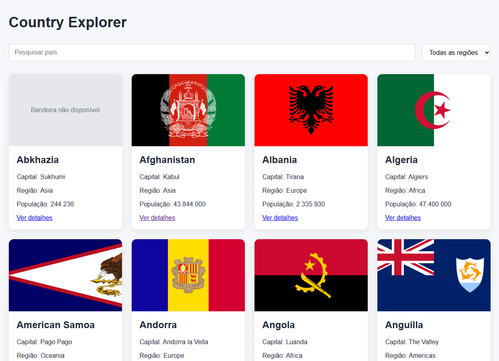

# 🌎 Country Explorer

Aplicação desenvolvida em **React** para explorar informações sobre países ao redor do mundo utilizando a REST Countries API.

O projeto permite pesquisar países, filtrar por região, navegar entre os resultados e visualizar informações detalhadas de cada país.

## 📸 Preview



## 🔗 Demo

Acesse o projeto online:

**[Country Explorer](https://country-explorer-phi-one.vercel.app/)**

## ✨ Funcionalidades

- Listagem de países
- Pesquisa de países por nome
- Filtro por região
- Paginação dos resultados
- Busca com debounce
- Página de detalhes de cada país
- Navegação com React Router
- Tratamento de loading e erros
- Tratamento de dados ausentes
- Layout responsivo

Na página de detalhes é possível visualizar informações como:

- Bandeira
- Capital
- Continente
- Região e sub-região
- População
- Área territorial
- Moedas
- Idiomas

## 🛠️ Tecnologias

- React
- JavaScript
- Vite
- React Router
- CSS
- REST API
- Fetch API

## 📡 API

Os dados utilizados pela aplicação são fornecidos pela **REST Countries API**.

A aplicação realiza consultas paginadas e permite combinar pesquisa por nome e região.

## 🚀 Como executar o projeto

Clone o repositório:

```bash
git clone https://github.com/PedroCDLoureiro/country-explorer
```

Entre na pasta:

```bash
cd country-explorer
```

Instale as dependências:

```bash
npm install
```

Crie um arquivo `.env` na raiz do projeto:

```env
VITE_REST_COUNTRIES_API_KEY=sua_api_key(API: https://restcountries.com/)
```

Execute o projeto:

```bash
npm run dev
```

A aplicação estará disponível no endereço exibido pelo Vite no terminal.

## 📁 Estrutura do projeto

```text
src/
├── components/
│   └── CountryCard.jsx
├── pages/
│   ├── Home.jsx
│   └── CountryDetails.jsx
├── App.jsx
└── main.jsx
```

## 🧠 Conceitos praticados

Durante o desenvolvimento foram aplicados conceitos importantes de React e JavaScript, como:

- `useState`
- `useEffect`
- Props
- Renderização condicional
- Componentização
- Manipulação de arrays com `map()` e `filter()`
- Requisições assíncronas com `async/await`
- Tratamento de erros com `try/catch/finally`
- Paginação server-side
- Debounce em campos de pesquisa
- Rotas dinâmicas
- `useParams`
- `useNavigate`
- Query parameters com `URLSearchParams`
- Variáveis de ambiente com Vite

## 📱 Responsividade

A interface foi desenvolvida para se adaptar a diferentes tamanhos de tela, utilizando **CSS Grid, Flexbox e media queries**.

## 📄 Licença

Este projeto foi desenvolvido para fins de estudo e portfólio.